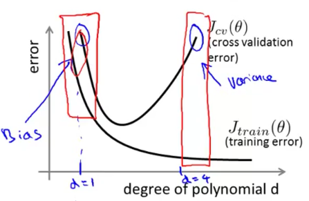
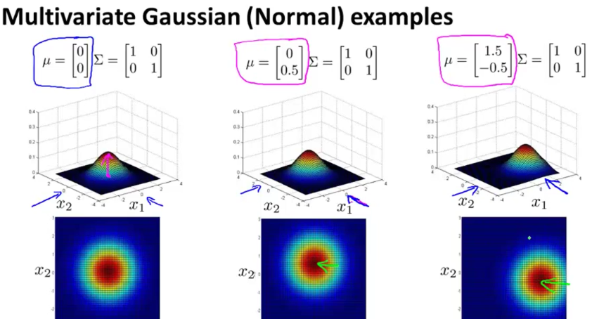

### Neural networks
* &Theta;ijl
  - i - mapping to node 1 in layer l+1
  - j - mapping from node j in layer l
  - l - mapping from layer 1

### Backpropagation in Practice
1. Pick a network architecture
  * input units : number of dimensions x ( dimensions of feature vector )
  * output units : number of classes in classification problem
  * hidden units :
    * default could be 1 hidden layer
    * normally more is better
    * but more is more computational expensive
2. Training a neural network
  1. randomly initialize the weights
    * small values near 0
  2. implement forward propegation to get h&theta;(x)i for any xi
  3. implement code to compute the cost function J(&theta;)
  4. implement back propagation to compute the partial derivatives
  5. Use gradient checking to compare the partial derivatives computed using the above algorithm and numerical estimation of gradient of J(&theta;)
    * disable the gradient checking code for when you actually run it
  6. Use gradient descent or an advanced optimization method with back propagation to try to minimize J(&theta;) as a function of parameters &theta;.
    * Can be susceptible to local minimum
    * In practice this is not usually a huge problem
    * Can't guarantee programs with find global optimum should find good local optimum at least

### Debugging a learning algorithms

* high variance
  - overfit
  - Jtrain(&theta;) will be low
  - Jcv(&theta;) >> Jtrain(&theta;)
  - generalizes poorly

* high bias
  - underfit
  - doesn't fit training data well
  - doesn't generalize either
  - Jtrain(&theta;) will be high
  - Jcv(&theta;) &asymp; Jtrain(&theta;)

* If cv error is high we're either at the high or the low end of d
* d too small &asymp; high bias problem
* d too large &asymp; high variance problem

* &lambda; = large -> high bias
* &lambda; = small -> high variance
* &lambda; = intermediate -> a reasonable fitting

##### How to fix results :
* get more training data
  - fixes high variance
* try a smaller set of features
  - fixes high variance
* try getting additional features
  - fixes high bias
* adding polynomial features* building your own, new, better features
  - fixes high bias
* try decreasing &lambda;
  - fixes high bias
* try increasing &lambda;
  - fixes high variance

### Handling Skewed data

| |1|0
|-|-|
| 1 | true positive | false positive |
| 0 | false negative | true negative  |

* true positive = predicted true and found to be true
* false positive = predicted true and found to be false
* false negative = predicted false and found to be true
* true negative = predicted false and found to be false

* Precision : of all patients where we predicted = 1, what fraction actually has cancer?
  * true positives / # predicted positive =
    * true positives / ( true pos + fake pos )
* Recall : of all patients that actually have cancer, what fraction did we correctly detect as having cancer?
* How often does our algorithm cause a false alarm?
* true positives / # actual positive =
  * true positives / (true pos + false neg)
* possible ways to compare precision/recall numbers
  - F1 Score : 2 (P*R) / (P+R)
    - if F1 is equal to 0 then it is false
    - use this to determine the predication has something like a 60% or 75% chance of being correct.
* using a learning algorithm with many parameters (e.g. logistic regression/linear regression with many features; neural network with many hidden units)
  * low bias algorithm
  * Jtrain(&theta;) will be small
* Use a very large training set (unlikely to overfit)
  * Jtrain(&theta;) &asymp; Jtest(&theta;)
  * Jtest(&theta;) will be small
* Low bias --> use complex algorithm
* Low variance --> use large training set

### Large Margin Classification Mathematics
##### norm of a vector

* ||u|| = euclidean length of vector u
* ||u|| = SQRT(u12+u22) = real number
  * length of arrow above
* p = length along *u* to the intersection
* p is the magnitude of the projection of vector *v* onto vector *u*
* p * ||u|| = u1v1+u2v2

### Kernal

* C ( similar to 1/&lambda; )
  * large C : lower bias, high variance ( small &lambda; )
  * small C : higher biasc, low variance ( large &lambda; )

* &sigma;2 is a parameter of the Gaussian kernel that determines the steepness of the rise around a landmark
  * large &sigma;2 : features fi vary more smoothly
    * higher bias, lower variance.
  * small &sigma;2 : features fi vary less smoothly
    * lower bias, higher variance.
* when choosing C and &sigma;2, choose whatever performs best on the cross-validation data

### Choosing a kernel
* n = number of features ( x &isin; Rn+1 )
* m = number of training examples
* n is large ( relative to m ) ( n &ge;m ; n=10000, m=10-1000)
  * use logistic regression, or SVM without a kernel ("linear kernel")
* n is small, m is intermediate : ( n = 1-1000, m=10-10,000)
  * Use SVM with Gaussian kernel
* n is small, m is large : (n=1-1000, m=50,000+)
  * create/add more features,
  * then use logistic regression or SVM without a kernel
  * SVM will be slow to run with Gaussian kernel

### Clustering
* learning from unlabeled data.
* k-means optimization
  - c(i) = index of cluster (1, 2,...,K) to which example x(i) is currently assigned
  - &mu;k = cluster centroid *k* (&mu;k&isin;Rn)
    - average of points assigned to cluster *k*
  - k : total number of cluster
  * &mu;c(i) = cluster centroid of cluster to which example x(i) has  been assigned
    - x(i) -> 5 ; c(i) ; &mu;c(i) = &mu;5
  - elbow method where the number of clusters has a drastic run off then levels out is not a realistic function.
      - normal is a gradual run off. find the purpose of the algorithm to determine the number of clusters
        - e.g. t-shirts 3 clusters for S;M;L | t-shirts 5 clusters for XS;S;M;L;XL;

###### Dimensionality Reduction
* Reduce data from n-dimensions to k-dimensions
* PCA tries to find a lower dimension surface to project the data to minimize the square distance.
* perform mean normalization and feature scaling before doing PCA
  * after mean normalization ( ensure every feature has zero mean)
* linear regression performs adjustments up and down on the linear
  - PCA performs them diagonally causing different results
* do not use PCA to fix overfitting
 - instead use regularization
 - may throw away useful dataset

##### Applications for PCA
* Compression
  - Why
    - Reduce memory/disk needed to store data
    - Speed up learning algorithm
* How do we chose k?
  - % of variance retained
* Visualization
  - Typically chose k =2 or k = 3
  - Because we can plot these values!

##### Anomaly evaluation
* Plot data what within and get it working correctly
  - when new information arrives and a data point is oddly outside the normal range of the initial graph this may be an anomaly and needs to be looked at.
* Fit model p(x) on training set {x<sup(1),...x<sup(m)}
* On a cross validation/test example *x*, predict
  - y = {1 if *p*(x) < &epsilon; (anomaly)}
  - y = {0 if *p*(x) &ge; (nomal)}
* Possible evaluation metrics :
  - True positive, false positive, false negative, true negative
  - Precision/Recall
  - F1-Score
* can also use cross validation set to choose parameter &epsilon;
* use anomaly detection when their are too many negative examples and the algorithm is not able to detect.
 - otherwise use supervised learning
* Anomaly Detection examples : ( must examine each and in some cases move them over to supervised learning )
  - fraud detection
  - manufacturing
  - monitoring machines in a data center
* Supervised learning examples :
  - email spam classification
  - weather predication
  - cancer classification

##### Choosing features to use
* plot a histogram to check if it has a Gaussian description
  - bell curve style graph
* Error analysis for anomaly detection
  - want p(x) large for normal examples *x*.
  - want p(x) small for anomalous examples *x*.
  - Most common problem :
    - p(x) is comparable (say, both large) for normal and anomalous examples

##### Multivariate Gaussian distribution
* balance the data to not count real data as anomaly.
* manipulate the sigma variables to change the shape of the prediction graph
  - &mu; changes the starting area of the graph
    - changes the peak of the distribution
  - &Sigma; changes the contour of the graph
    - changes distribution
  - this helps change the model correlation between data

* Original Model
  - manually create features to capture anomalies
    - combine values
  - computationally cheaper
    - scales better to large *n*
  - ok even if *m* (training set size) is small

* Multivariate Gaussian
  - Automatically captures correlations between features
  - computationally more expensive
  - must have ** *m* > *n* ** or else &Sigma; is non-invertable
    - m &ge; 10n
      - should only be used if m >> n
  - eliminates redundant features
    - features that are linearly dependent.
* if the matrix is non-invertible
  - m < n
    - use original simple model
  - redundant features
    - two features that are the same.
    - use PCA or sanity check your data

##### problem formulation
* movie rating example
  - nu
  - nm
  - r(i,j) = 1 if user j has rated movie i
  - y(i,j) = rating given by user *j* to movie *i* (defined only if r(i,j)=1)
* content based approach
  - finds the features of the movies to make the prediction for the user.

##### Collaborative Filtering
* Every user is helping the algorithm to get better features
* Collaborative filtering algorithm
  1. Initialize x(1),...,x(nm), &theta;(1),...,&theta;(nu)
  2. Minimize J(x(1),...,x(nm), &theta;(1),...,&theta;(nu)) using gradient descent (or an advanced optimization algorithm). E.g. for every j=1,...,n*u*, i=1,...,n*m*
    - this regularize ever parameters
  3. For a user with parameters &theta; and a movie with (learned) features *x*, predict a star rating of &theta;*T**x*.
    - if (&theta;(j))*T*(x)(i)
* simultaneously learn good features and learn good parameters for users and give good predictions that they have not yet rated.
* mean normalization works well in the rating system of 0-5 stars since it is already small.

###### Map-reduce
* split the training set into multiple parts, solve for those sets, then combine.
* using multiple cores to process each part.
  - reduces network latency
  - also use multiple machines

##### Photo OCR
* Photo OCR Pipeline
  1. text detection
    - find objects in an image that are words
  2. character segmentation
    - separate the image into letters
  3. character classification
    - sort through the letters to determine what they are
* sliding window detection
  - take a relatively small rectangle and space it throughout the image
  - each iteration is considered the step-size/stride
##### Ceiling analysis
* The "ceiling" is that each module has a ceiling by which making it perfect would improve the system overall
