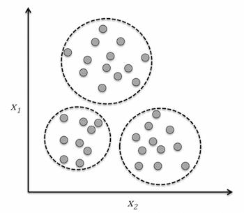
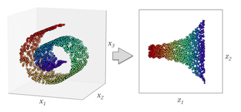
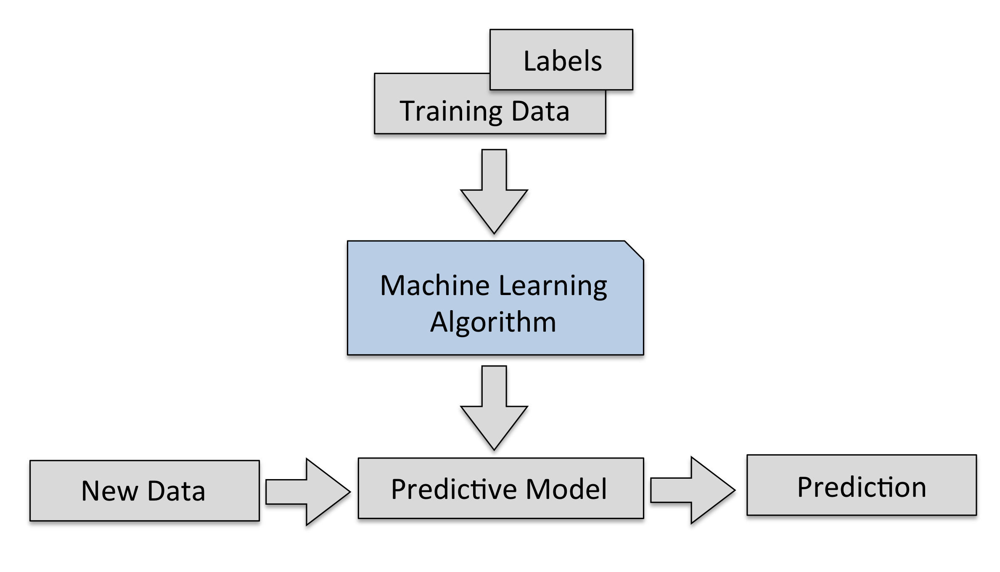
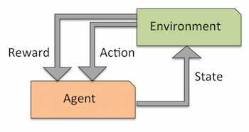
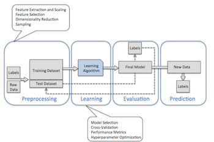

# Chapter 1

## This chapter will cover the following topics
* The general concepts of machine learning
* The three types of learning and basic terminalogy
* The building blocks for successfully designing machine learning systems

## Unsupervised Learning
* *unsupervised learning* : dealing with unlabeled data or data of unknown structure.
* Explore the structure of our data to extract meaningful information without the guidance of a known outcome variable or reward function.

##### Clustering
* *clustering* : is an exploratory data analysis technique that allows us to organize a pile of information into meaningful subgroups (clusters) without having any prior knowledge of their [group memberships].

* EXAMPLE :
  - Marketers to discover customer groups based on their interests in order to develop distinct marketing programs

##### Dimensionality Reduction ( subfield of unsupervised learning)
* *dimensionality reduction* : reduce the amount *noise data* which can degrade the predictive performance of certain algorithms, and compress the data onto a smaller dimensional subspace while retaining most of the relevant information.
* This technique can also help reduce storage space and computing performance.

Visual representation of reducing a 3d plot to 2d

## Supervised Learning
* *supervised learning* : to learn a model from *labeled training data* that will let us make a prediction about unseen or future data.
* Desired labels (output signals) are already known.
    - e.g. taking email that has been labeled as spam or not-spam, then predicting where a new email will fall in that category.

##### Classification ( subcategory of Supervised Learning )
* defined by having discrete class labels
  - EXAMPLE : spam / not-spam
* Goal : To predict the categorical [class labels] of new instances based on past observations.
* multi-class classification has more than 2 [class labels].
* binary classification : Where the machine learning algorithm learns a set of rules in order to distinguish between two possible classes : spam and non-spam email.

##### Regression (subcategory of Supervised Learning)
* Regression Analysis : Given a number of predictor (explanatory) variables and a continuous response variable (outcome), and we try to find a relationship between those variables that allows us to predict an outcome.
* Predicting continuous outcomes, also called [regression analysis]
* EXAMPLE : Predict a students SAT score
  - x = time spent learning
  - y = test score

## Reinforced Learning
* Goal : develop a system (agent) that improves its performance based on interactions with the *environment*.
* EXAMPLE : Chess Engine
  - decide a series of moves depending on the state of the board (environment)
  - To *reward* can be defined as win or lose at the end of the game

## Basic Terminology
* features = columns
* [superscript] (i) to refer to the *i*th training sample
* [subscript] j to refer to the *j*th of the training set
* lower-case, bold-face letters refer to vectors
  - **x** &isin; &#8477;**n**x1
* upper-case, bold-face letters refer to matrices
  - **X** &isin; &#8477;**n**x**m**
* [&#8477;] : set of real numbers
* n : number of rows
* m : number of columns

## Preprocessing
* turning raw data into useful information
  * EXAMPLE : images of flowers
    - color
    - hue
    - intensity of flowers
    - height
    - flower lengths and width
* Goal : process the selected features to be on the same scale for optimal performance, mainly achieved by transforming the features in the range of \[0, 1\] or a standard normal distribution with [zero mean] and [unit variance].
* Use [dimensionality reduction] to compress features onto a lower dimensional subspace when the features are [highly correlated] and therefore redundant to a certain degree.
  - this will create a faster algorithm that takes up less storage space.

## Predictive Model
* A question to ask before a problem :
> How do we know which model performs well on the final test dataset and real-world data if we don't use this test set for the model selection but keep it for the final model evaluation?

  * objective : different cross-validation techniques can be used where the training dataset is further divided into training and validation subsets in order to estimate the [generalization performance] of the model.
  * problem : we cannot not assume the algorithms provided by our software libraries are optimal for our specific problem
  * solution : to solve this we will use [hyperparameter] \_ [optimization techniques] that help us to fine-tune the performance of our model in later chapters.

## Summary
* Supervised learning, we know the right answer beforehand when we train the model
  - classification : categorize objects into known classes
  - regression analysis : predict the continuous outcomes of target variables.
* Reinforcement learning, we define a measure of reward for particular actions by the agent
* Unsupervised learning, dealing with unlabeled data or data of unknown structure.
  - useful for data compression in feature preprocessing steps
* http://www.lfd.uci.edu/~gohlke/pythonlibs/#numpy to download any windows python package
  - have to install *numpy* via a wheel file to get the other packages working

[class labels]: ../GLOSSARY.md#class-labels
[regression analysis]: ../GLOSSARY.md#regression-analysis
[clustering]: ../GLOSSARY.md#clustering
[unsupervised learning]: ../GLOSSARY.md#unsupervised-learning
[supervised learning]: ../GLOSSARY.md#supervised-learning
[dimensionality reduction]: ../GLOSSARY.md#dimensionality-reduction
[group memberships]: ../GLOSSARY.md#group-memberships
[superscript]: ../SYMBOL_GLOSSARY.md#superscript
[subscript]: ../SYMBOL_GLOSSARY.md#subscript
[&#8477;]: ../SYMBOL_GLOSSARY.md#set-of-real-numbers
[zero mean]: ../GLOSSARY.md#zero-mean
[unit variance]: ../GLOSSARY.md#unit-variance
[highly correlated]: ../GLOSSARY.md#highly-correlated
[generalization performance]: ../GLOSSARY.md#generalization-performance
[optimization techniques]: ../GLOSSARY.md#optimization-techniques
[hyperparameter]: ../GLOSSARY.md#hyperparameter
