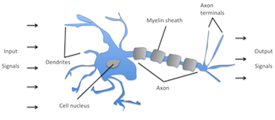
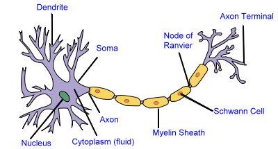
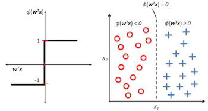
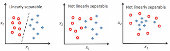
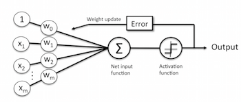
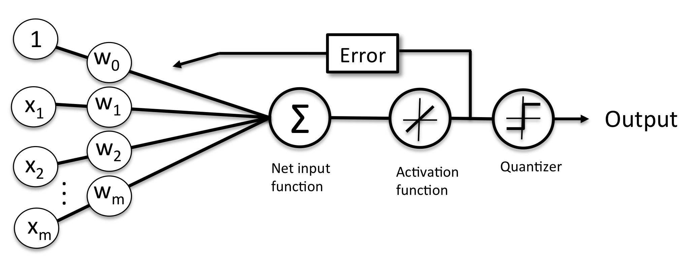
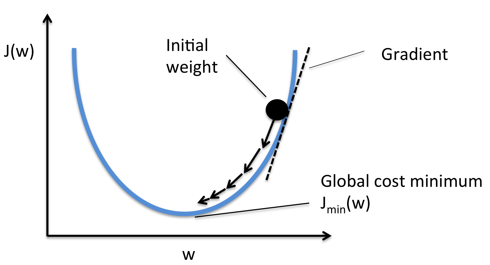
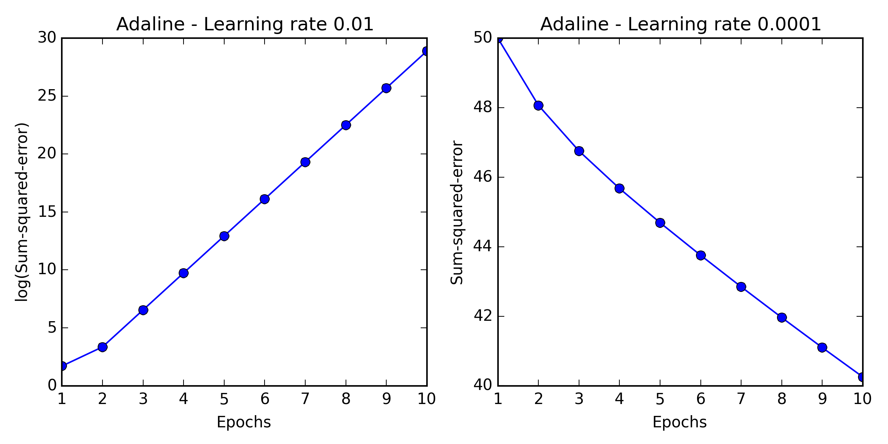

# Chapter 2

## This chapter will cover the following topics
* Building an intuition for machine learning algorithms
* Using pandas, NumPy, and matplotlib to read in , process, and visualize data
* Implementing linear classification algorithms in Python

## Artificial Neurons - a small history of machine learning
* Trying to understand how the biological brain works to design artificial intelligence
* Nerve cell as a simple logic gate with binary outputs; multiple signals arrive at the dendrites, are then integrated into the cell body, and, if the accumulated signal exceeds a certain threshold, an output signal is generated that will be passed on by the axon.

* perceptron : a Perceiving and Recognizing Automaton
  - is an algorithm for supervised learning of binary classifiers: functions that can decide whether an input (represented by a vector of numbers) belongs to one class or another.

EXAMPLE :
* our two classes : 1 (positive class) and -1 ( negative class)
* activation function &empty;(z)
  - this takes a linear combination of certain input values x and a corresponding weight vector w, where z is the co-called net input (z = w1x1 + ... + wmxm)
* if the activation of a particular sample x(i) ( output of &empty;(z) ) is greater than a defined threashold of &theta;, we predict class 1 and class -1.
* [perceptron] algorithm, the [activation function] &empty;(&bull;) is a [unit step function]
  * &empty;(z) = (1 if z &ge; &theta;, -1 otherwise)
* z = w1x1 + ... + wmxm =
  - &sum;mj=0 xjwj =
  - wTx and &empty;(z) = (1 if z &ge; &theta;, -1 otherwise)
* z= wTx is put into a binary output (-1 or 1) by the [activation function] of the [perceptron] (left figure) and how it can be used to discriminate between two linearly separable classes (right figure)

* 

* initial [perceptron] can be summarized by the following steps:
  1. Initialize the weights to 0 or small random numbers
  2. For each training sample x(i) perform the following steps:
    1. compute the output value &#375;
    2. Update the weights
* in the above example the &#375; is the class label predicted by the [unit step function]
* simultaneous update of each weight wj can be written as:
  * wj := wj + &Delta;wj
* &Delta;wj, used to update wj, is calculated by the [perceptron] learning rule:
  - &Delta;wj = &eta;(y(i)-&#375;(i))x(i)j
* &eta; = learning rate (a constant between 0.0 and 1.0)
* y(i) = true class label of the *i* th training sample
* &#375;(i) is the predicated class label;
* all weights in the weight vector are being updated simultaneously
  - which means we don't recompute &#375;(i) before all of the weights &Delta;wj were updated.
* for a 2d data set use.
 - > &Delta;w0 = &eta;(y(i)-output)
 - > &Delta;w1 = &eta;(y(i)-output)x(i)1
 - > &Delta;w2 = &eta;(y(i)-output)x(i)2

* predicting the class label *correctly*, the weights would remain unchanged
  - > &Delta;wj = &eta;(-1--1)x(i)j = 0
  - > &Delta;wj = &eta;(1-1)x(i)j = 0
* predicting the class label *incorrectly*
  - > &Delta;wj = &eta;(1--1)x(i)j = &eta;(2)x(i)j
  - > &Delta;wj = &eta;(-1-1)x(i)j = &eta;(-2)x(i)j

* convergence of the perceptron is only guaranteed if the two classes are linearly separable and the learning rate is sufficiently small.
  - if the two classes can't be separated by linear decision boundary, set a maximum number of passes over the training dataset (epochs) and/or a threshold for the number of tolerated misclassifications
    - otherwise the perceptron would never stop updating the weights.

* 

* general concept of the perceptron
  - 

    1. receives inputs of a sample x
    2. combines them with the weights w to compute the net input
    3. net input is passed on to the [activation function] (in this case the [unit step function])
      * this generates a binary output -1 and +1 (predicted class label of the sample)
    4. the output is use to calculate the error of the prediction and update the weights

## Implementing Python
See Chapter 2 code examples from book.

* One-vs-All (OvA) : Train one classier per class. Then treat it as +1 and the rest of the data as -1.  Using a new data sample we would use our *n* classifiers, where *n* is the number of class labels, and assign the class label the the highest confidence to particular sample.

##### Using matplotlib
* creating a plot with matplotlib.colors.ListedColormap.
  1. define colors and markers
  2. determine the maximum and minimum values for the two features
    1. This allows us to create a grid arrays ( in example xx1 and xx2) with numpy.meshgrid()
  3. Flatten the grid arrays and create a matrix that has the same number of columns as the iris training subset
  4. Once reshaping the predicted class labels *z* into a grid with dimensions of xx1 and xx2 it will create a contour plot with matplotlib's contourf.

##### Adaptive Linear Neuron
* ADAptive LInear NEuron (Adaline) : Illustrates the key concepts of defining and minimizing cost functions. Takes off where [perceptron] but the weights are updated based on a linear activation function rather than a unit step function.
* linear activation function &empty;(z) is the identity funciton of the net input so that
    - &empty;(wTx) = wTx
* a quantizer similiar to [unit step function] in [perceptron]
  - see formal definition [here](../GLOASSARY.md#quantizer)
* 
* key ingredient of supervised machine learning algorithms is to define an objective function to be optimized during the learning process.
 - in this case it is a [cost function] that normally gets minimized.
* Define the [cost function] *J* to learn the weights as the **Sum of Squared Errors (SSE)** between the calculated outcome and the true clas label
  - J(w) = 1/2 &sum;i (y(i)-&empty;(z(i)))2
    - 1/2 is added for convenience to make it easier to derive the gradient.
    - since the function is convex we can use the optimization algorithm, [gradient descent], to find the weights that minimize our cost function to classify the samples in the datasets.
      - thinking of [gradient descent] as *climibing down a hill* until a local or global cost minimum is reached.
      - step size is determined by the value of the learning rate as well as the slope fo the gradient

* gradient formula after chagne = &nabla;J(w)
* weight change is defined as the negative gradient multiplied by the learning rate &eta;
  - &Delta;w = -&eta;&nabla;J(w)
* updating weights = w := w + &Delta;w
* to complete the gradient of cost function, we need to compute the partial derivative.
  - see page 35/36 for details

* using a large learning rate can overshoot the model.
  - instead of minimizing the cost function, the error becomes larger every [epoch]
* using a small one can take too long to solve a function
  - using more epochs then necessary to solve the problem.
* 

* feature scaling : method used to standardize the range of independent variables or features of data. In data processing, it is also known as data normalization and is generally performed during the data preprocessing step.
  - in this chapter we use [feature scaling] method called standardization
    - this gives the model a standard normal distribution.
  - the mean of each feature (column) is centered at value 0
  - the feature column has a standard deviation of 1.
  - to standardize the *j* th feature
    1. subtract the &mu;j from every training sample
    2. then divide it by the standard deviation
        * x'j = xj-&mu;j / &sigma;j
  - xj is a vector consisting of the *j* th feature values of all training samples in &eta;
  - the [SSE] can remain non-zero even though all samples are classified correctly.

##### Stochastic Gradient Descent
* alternative to [gradient descent] is the [stochastic] gradient descent algorithm ( aka iterative or on-line gradient)
* update the weights incrementally for each training sample
  - instead of weights based on the sum of accumulated errors over the sampes of x(i)
* gradient = &eta;&sum;i (y(i)-&empty;(z(i)))x(i)
* [stochastic] = &eta;(y(i) - &empty;(z(i)))x(i)
* [stochastic] can be considered an approximation of [gradient descent]
  - pro:
    * reaches convergence much faster
    * use it for online-learning ( new data arrives on-the-fly ) making it easy for the system to adapt.
  - con :
    * noisier than [gradient descent] ( although this means it can escape shallow local minima ore readily.)
* best to present data in random order
* &eta;  is often replace by an adaptive learning rate that decreases over time.
  - this means it wil not reach the global minimum but an area very close.
    - achieve further progress to a better global minimum by using an adaptive learning rate.

##### Mini-batch learning
* compromise between batch and [stochastic] gradient descent is mini-batch learning-rate
* apply batch gradient descent to smaller subsets of the training data
  - example : 50 lines at a time.
* pro :
  - converges faster due to more frequent weight updates
  - allows us to replace the for-loop over the training samples in [stochastic] model.

##### resources :
linear algebra review : https://www.cs.cmu.edu/~zkolter/course/linalg/linalg_notes.pdf

[class labels]: ../GLOSSARY.md#class-labels
[perceptron]: ../GLOSSARY.md#perceptron
[adaptive linear neurons]: ../GLOSSARY.md#adaptive-linear-neurons
[unit step function]: ../GLOSSARY.md#unit-step-function
[activation function]: ../GLOSSARY.md#activation-function
[epochs]: ../GLOSSARY.md#epochs
[epoch]: ../GLOSSARY.md#epochs
[One-vs-All]: ../GLOSSARY.md#One-vs.-All
[objective function]: ../GLOSSARY.md#objective-function
[cost function]: ../GLOSSARY.md#cost-function
[gradient descent]: ../GLOSSARY.md#gradient-descent
[feature scaling]: ../GLOSSARY.md#feature-scaling
[SSE]: ../GLOSSARY.md#sumof-squared-errors
[sum of squared errors]: ../GLOSSARY.md#sumof-squared-errors
[stochastic]: ../GLOSSARY.md#stochastic-gradient-descent
[mini-batch learning]: ../GLOSSARY.md#mini-batch-learning
