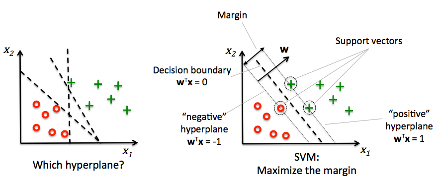
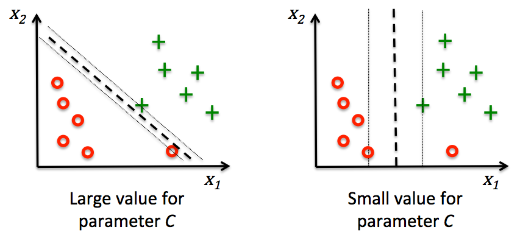

# Chapter 3
## This chapter will cover the following topics

NOTE: This chapter goes along with the chapter 3 code given with the book.

* Introduction to the concepts of popular classification algorithms
* Using the scikit-learn machine learning library
* Questions to ask when selecting a machine learning algorithm

## scikit for classification
* from sklearn import datasets
  - imports pre-made datasets for examples
* from sklearn.cross_validation import train_test_split
  - splits data into training and test data
* from sklearn.preprocessing import StandardScaler
  - with StandardScaler.fit
    - creates the &sigma; (standard deviation) and &mu; (sample mean) for each feature dimension
  - with StandardScaler.transform()
    - then standardize the training data using those estimated parameters &mu; and &sigma;
* from sklearn.linear_model import Perceptron
  - runs the Perceptron algorithm with the data
    - n_iter : number of epochs ( passes over the training set )
    - eta0 : learning rate
    - random_state option is used for reproducibility of the initial shuffling of the training dataset after each epoch
* Perceptron.predict
  - use &sigma; test data to start predicting
  - (y_test != y_pred).sum() will show the misclassifications if any.
    - 4/45 = 8.9
  - from sklearn.metrics import accuracy_score
    - shows the accuracy of given data.

* from matplotlib.colors import ListedColoramp
 - creates base color map
* import matplotlib.pyplot as pyplot
 - used to create plot

###### SVM ( support vector machines )
* used to maximize the margin within the graph.
  * margin : distance between the separating hyperplane ( decision boundary )
  * support vectors samples closest to the hyperplane

* C controls the penalty for misclassification.
  * use to control the margin, thus tuning the bias-variance trade-off
* large c = large error penalties
  * increases bias, decrease variance
* small c = less strict error penalties
  * decrease bias, increases variance

##### Decision tree learning
* start at the root and split the data on the feature that results in the largest **information gain** (IG)
* prune a tree by setting a limit for the maximal depth of the tree.
* information gain
  - *I*G (Dp, &#402;)= *I*(Dp)-&sum;mj=1 Nj / Np*I*(Dj)
    - &#402; : performs the split
    - Dp and Dj : datasets of the parent and *j*th child node
    - *I* is the impurity measure
    - Nj is the number of samples in the *j* th child node
    - Np is the total number of samples at the parent node
      * IG is the difference between the impurity of the parent node and the sum of the child node impurities.
      * lower the impurity of the child nodes, the larger the information gain.
* scikit-learn uses a binary decision tree : each parent node is split into two child nodes, D*left* and D*right*
  * *I*G (Dp, a) = *I*(Dp)-N*left* / Np *I*(D*left*)-N*right*/Np*I*(D*right*)
* IG = [Gini Impurity]
* IH = [entropy]
* IE = classification error
* IH : IH(t)=-&sum;ci=1 p(i|t)log2p(i|t)
  - p(i|t) : proportion of the samples that belongs to class *c* for a particular node *t*
  - entropy is 0 if all samples at a node belong to the same class
  - entropy is maximal if we have a uniform class distribution
    - entropy is 0 if p(i=1|t)=1 or p(i=0|t)=0
    - if distributed uniformly p(i=1|t)=0.5 or p(i=0|t)=0.5
      - entropy = 1
      - entropy criterion attempts to maximize the mutual information
* IG : criterion to minimize the probability of misclassification
  - IG(t)=-&sum;ci=1 p(i|t)(1-p(i|t))=1-&sum;ci=1p(i|t)2
  - maximal if the classes are perfectly mixed
    - 1-&sum;ci=10.52 = 0.5
* IE : IE = 1 - max {p(i|t)}
  - recommended for growing a decision tree
  - less sensitive to changes in class probabilities of the node

###### Random Forest
* seen as an ensemble of decision trees.
 - each part of the tree taken together so that each part is looked at in relation to the whole.
 * combine
  - weak learners to build a more robust model
  - strong learner has a better generalization error and is less susceptible to overfitting.
* summarized in 4 steps :
  1. Draw a random bootstrap sample of size *n* ( randomly choose *n* samples from a training set with replacement )
  2. Grow a decision tree from the bootstrap sample
    1. Randomly select *d* features without replacement
    2. Split the node using the feature that provides the best split according to the objective function, for instance, by maximizing the information gain.
  3. Repeat the steps 1 to 2 *k* times
  4. Aggregate the prediction by each tree to assign the class label by majority vote.
* Pro
  - don't have to choose good hyperparameter values
  - don't need to prune since the ensemble model is good against noise from individual trees
* Main parameter to care about is the number of trees *k*
* larger number of trees better the performance of the random forest classifier at the expense of an increased computational cost.

##### k-Nearest neighbors (KNN)
* lazy learner : doesn't learn a discriminative function from the training data but memorizes the training dataset instead.
* summarized by the following steps :
  1. Choose the number of *k* and a distance metrics
  2. Find the *k* nearest neighbors of the sample that we want to classify
  3. Assign the class label by majority vote.
* Pro
  - immediately adapts as we collect new training data
* Con
  - computational complexity for classifying new samples grows linearly with the number of samples in the training dataset.

##### Summary
* decision trees
  - good if we care about interpretability
* logistic regression
  - good to predict the probability of a particular event
* support vector machines
  - powerful linear models that can extend to nonlinear problems via kernal trick.
  - they have many parameters that have to be tuned in order to make good predictions
* random forest (ensemble method)
  - good since it doesn't require much parameter turning
  - good since it doesn't overfit so easily as decision trees
* K-nearest neighbor (KNN)
  - make predictions without any model training but more computationally expensive predictions step.
* more important then the right algorithm is the data in our training dataset.
  - algorithms cannot make good predictions without informative and discriminatory features.

[entropy]: ../GLOSSARY#entropy
[Gini Impurity]: ../GLOSSARY#Gini-impurity
