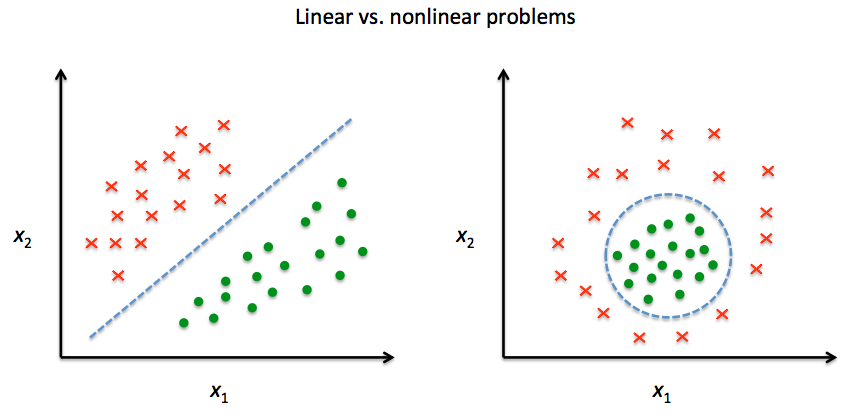

# Chapter 5
## This chapter will cover the following topics

* **Principal component analysis** (PCA) for unsupervised data compression
* **Linear Discriminant Analysis** (LDA) as supervised dimensionality reduction technique for maximizing class separability
* Nonlinear dimensionality reduction via **kernal principal component analysis**

##### PCA
* identify patters in data, based on the correlation between features.
  - find directions of maximum variance.
* unsupervised method
  - class labels are ignored
  - random forest  uses class membership information to compute the node impurities
* uses :
  * de-noising of signals
  * exploratory data analyses
    - analyzing data sets to summarize their main characteristics, often with visual methods
* con :
  - highly sensitive to data scaling
    - fix : standardize the features prior to PCA.
* Steps used in PCA
  1. Standardize the d-dimensional dataset
  2. Construct the [covariance matrix].
  3. Decompose the covariance matrix into its [eigenvectors] and [eigenvalues].
  4. Select *k* eigenvectors that correspond to the *k* largest eigenvalues,
  where *k* is the dimensionality of the new feature subspace (*k* &le; *d*).
  5. Construct a projection matrix **_W_** from the "top" *k* eigenvectors.
  6. Transform the d-dimensional input dataset **_X_** using the projection matrix **_W_** to obtain the new *k*-dimensional feature subspace.

##### LDA
* find the feature subspace that optimizes class separability
* Steps used in LDA
  1. Standardize the *d*-dimensional dataset ( *d* is the number of features )
  2. For each class, compute the *d*-dimensional mean vector
  3. Construct the between-class scatter matrix **_S_***b* and the within-class scatter matrix **_S_***w*
  4. Compute the [eigenvectors] and corresponding [eigenvalues] of the matrix **_S_***b*-1**_S_***B*
  5. Choose the *k* [eigenvectors] that correspond to the *k* largest eigenvalues to construct a *d* x *k*-dimensional transformation matrix **w** ; the [eigenvectors] are the columns of the matrix
  6. Project the samples onto the new feature subspace using the transformation matrix **_w_**.
* things to assume :
  - features are normally distributed and independent of each other.
  - covariance matrices for the individual classes are identical.
  - even if this is not done LDA may still work

##### Kernel PCA
* can't nomrally use LDA and PCA for non linear problems
* Adaline, Logistic regression and SVM assumes noise is the culprit for imperfect estimations
* kernal PCA transforms non linearly separable data onto a new, lower-dimensional subspace that is suitable for linear classifiers

* commmonly used kernels are
  - polynomial kernels
  - hyperbolic tangent (sigmoid) kernels
  - Radial Basis Function(RBF) or Gaussian Kernel

###### Summary
* PCA
  - project data onto a lower-dimensional subspace to maximize the variance along the orthogonal feature axes while ignoring class labels
  - unsupervised dimensionality reduction
* LDA
  - supervised dimensionality reduction
  - uses class information in data to maximize the class-separability in a linear feature space.
* kernal PCA
  - map nonlinear datasets onto a lower-dimensional feature space where the classes become linear separable

[covariance matrix]: ../GLOSSARY#covariance-matrix
[eigenvectors]: ../GLOSSARY#eigenvectors
[eigenvalues]: ../GLOSSARY#eigenvalues
