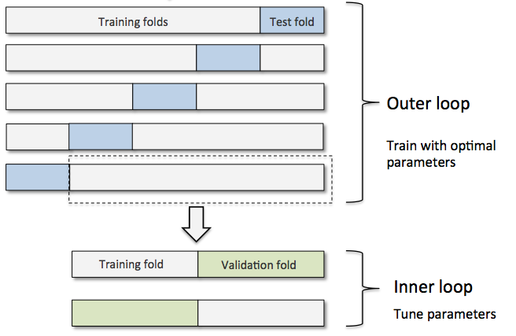

# Chapter 6
## This chapter will cover the following topics

* Obtain unbiased estimates of a model's performance
* Diagnose the common problems of machine learning algorithms
* Fine-tune machine learning models
* Evaluate predictive models using different performance metrics

##### Pipeline
* develop a model including arbitrary number of transformations steps and apply it to make predictions about new data
  - can be any number of steps
  - allows us to make a system then fit it to different types of data.

##### holdout cross-validation & k-fold cross-validation
* both obtain reliable estimates of the model's generalization error.
  - how well the model performs on unseen data.
* model selection
  - refers to a given classification problem for which we want to select the optimal values of tuning parameters (hyperparameters)
  - using the same training data over and over again causes overfitting
* holdout cross-validation
  - separate data into three parts
    1. training set
      - fit different models
      - goes through the machine learning algorithm
    2. validation settings
      - performance of the validation set is then used for model selection.
      - run with the predictive model
    3. test set
      - one that the model hasn't seen before
        - creates a less bias estimate
      - end with the predictive model for evaluation
  - cons
    - estimate will vary for different samples of the data

  
* k-fold cross-validation
  - repeat the holdout method k times on k subsets of the training data
  - steps
    - randomly split the training dataset into *k* folds without replacement
    - k-1 folds are used for the model training
      - 1 fold is used for testing
    - procedure is repeated *k* times so that we obtain *k* models and performance estimates
  - in small datasets
    - leave-one-out (LOO)
      - set number of folds equal to the number of training samples (k=m)
      - only one training sample is used for testing during each iteration.
      - used for working with very small datasets
    - useful to increase number of folds
      - increase k and more training data will be used in each iteration
      - resulting in lower bias.
      - cons
        - increases runtime
        - yields higher variance
          - due to training folds being similar
  - in large datasets
    - choose smaller value for k
      - reduces computational cost
      - works since we are doing with more data
* use stratified k-fold-cross-validation in cases of unequal class proportions
  - this technique can provide better bias and variance estimates

##### Debugging algorithms with learning and validation curves
* learning curves
  - checks if a learning algorithm has an issue with overfitting ( high variance ) or underfitting ( high bias ).
* validation curves
  - address common issues with learning algorithms

###### grid search
* finds the optimal combination of hyperparameter values
* a brute-force exhaustive search paradigm
  1. specify a list of values for different hyperparameters
  2. computer evaluates the model performance for each combination of those to obtain the optimal set.
* computationally expensive since it is looking at all possibilities.
  - alternative is scikit-learn's RandomizedSearchCV

##### Algorithm selection with nested cross-validation
* split the k-fold cross-validation loop into training and test folds
  - inner loop selects the model using k-fold cross-validation on the training fold.

###### confusion matrix
* lays out the performance of a learning algorithm
* counts the true positive (TP), true negative (TN), false positive (FP), and false negative (FN) predictions of a classifier

###### Optimizing precision and recall of a classification model
* prediction error (ERR) & accuracy (ACC)
  - provide general information about how many samples are misclassified
* ERR
  - sum of all false predictions divided by the number of total predictions
  - ERR = FP + FN / FP + FN + TP + TN
* ACC
  - sum of corrected predictions divided by the total number of predictions
  - ACC = TP + TN / FP + FN + TP + TN = 1 - ERR
* true positive rate (TPR) and false positive rate (FPR)
  - performance metrics useful for imbalanced class problems
  - FPR = FP / N = FP / FP + TN
  - TPR = TP / P = TP / FN + TP
    - N = Negative
    - P = Positive
* precision (PRE) and recall (REC)
  - performance matrics that are related to those true positive and true negative rates
    - recall is synonymous to the TPR
  - PRE = TP / TP + FP
  - REC = TPR = TP / P = TP / FN + TP
* F1-score is a combination of precision and recall
  - F1 = 2 (PRE * REC / PRE + REC)
* when using grid search we can use the above methods as a scoring metrics

##### Plotting a receiver operating characteristic
* receiver operator characteristic (ROC)
* graphs used for selecting models for classification based on performance
  - diagonal of an ROC graph can be interpreted as random guessing
  - below the line are considered worse than random guessing
  - top left would be TP rate of 1 and a FP of 0

##### Scoring metrics for multiclass classification
* use macro and micro averaging methods to extend scoring metrics to multiclass problems via One vs All classification
* micro-average
  - calculated from the individual TP, TN, FP, FN of the system
  - PREmicro = TP1 + ... + TPk / TP1 + ... + TPk + FP1 + ... + FPk
  - weight each instance or prediction equally
* macro-average
  - PREmacro = PRE1+...+PREk / k
  - weights all classes equally to evaluate the overall performance of a classifier with regard to the most frequent class labels
  - default when using a binary performance metrics

##### Summary
* use of convenient model piplines train and evaluate machine learning models more effeciently
* k-fold-cross-validation determines learning and validation curves to diagnose the common problems of learning algorithms
  - overfitting and underfitting
* grid search further fine tunes the model
* use confusion matrix and various different performance matric to optimize a models performance
  - PRE
  - REC
  - ACC
  - ERR
  - TPR / FPR
