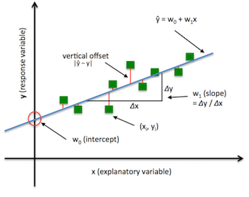
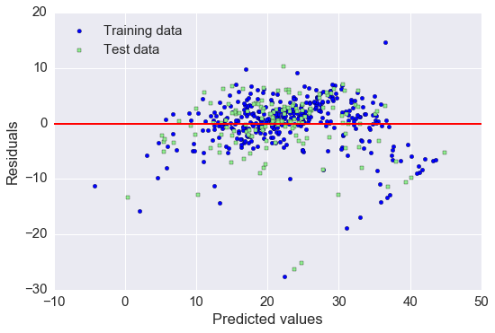
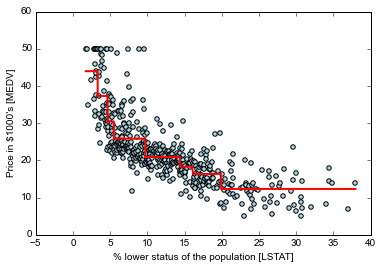

# Chapter 10
## This chapter will cover the following topics
* Exploring and visualizing datasets
* Looking at different approaches to implement linear regression models
* Training regression models that are robust to outliers
* Evaluating regression models and diagnosing common problems
* Fitting regression models to nonlinear data

##### simple linear regression models
* goal of linear regression
  - model the relationship between single feature (explanatory variable *x*) and a continuous valued *response* (target variable *y*)
  - y = w0 + w1x
    - w0 y axis intercepts
    - w1 coefficient of the explanatory variable

* best fitting line is the regression line
* vertical lines from the regression line
  - errors of our prediction
  - called offsets or residuals
* simple linear regression
  - special case of one explanatory variable
* multiple linear regression
  - linear regression model to multiple explanatory variables

##### Housing data
* a set of 506 samples with 14 features.
* target variable
  - Housing Price (MEDV)
* explanatory variables
  - the other 13 features
* correlation matrix contains the **Pearson product-moment correlation coefficients**
  - measure the linear dependence between pairs of features
  - r=1 perfect positive correlation
  - r=0 no correlation
  - r=-1 perfect negative correlation

##### ordinary least squares linear regression model
* Ordinary Least Squares (OLS)
  - estimates the parameters of the regression line that minimizes the sum of the squared vertical distances to the sample points

##### Solving regression for regression parameters with gradient descent
* ADAptive LInear NEuron (Adaline)
* identical to the OLS cost function

##### estimating the coefficient of a regression model via scikit-learn
* pro
  - guaranteed to find the optimal solution analytically
* con
  - computationally too expensive to invert the matrix.

##### fitting a robust regression model using RANSAC
* linear regression models can be heavily impacted by outliers
* RANdom SAmple Consensus (RANSAC)
  - an alternative to throwing out outliers
* RANSAC
  1. Select a random number of samples to be inliers and fit the models
  2. Test all other data points against the fitted model and add those points that fall within a user-given tolerance to the inliers
  3. Refit the model using all inliers
  4. Estimate the error of the fitted model versus the inliers
  5. Terminate the algorithm if the performance meets a certain user-defined threshold or if a fixed number of iterations has been reached; go back to step 1 otherwise.
* MAD stand for Median Absolute Deviation
  - selects the inlier threshold

##### evaluating the performance of linear regression models
* use of multiple explanatory variables means we can't visualize the regression line.
  - in a 2d plot at least
  - can plot the residuals verse the predicted values to diagnose our regression models
* residual plots are commonly used to detect nonlinearity and outliers
  - check if errors are randomly distributed
* patterns in residual plots means that our model is unable to capture some explanatory information.
  - this leaks into the residuals.

* mean squared error (MSE)
  - average of the SSE cost function that we minimize to fit the linear regression models
  - comparing different regression models or
  - tuning their parameters via a grid search and cross-validation
  - high means we are overfitting the datasets
* coefficient of determination ( R2 )
  - standardized version of the MSE
  - better interpretability of model performance
  - fraction of the response variance that is captured by the model

###### regularized methods for regression
* regularization
  - helps stop overfitting by adding additional information
* most popular regular linear regression
  - Ridge Regression
  - Least Absolute Shrinkage and Selection Operator (LASSO)
  - Elastic net
* Ridge Regression
  - L2 penalized model
* LASSO
  - depending on the regularization strength certain weights can become zero
    - useful for a supervised feature selection technique
  - limitation : selects at most n variables if m > n.
* elastic net
  - compromise for Ridge and LASSO
  - L1 penalty to generate sparsity
  - L2 penalty to overcome some of the limitations of the LASSO
  - allows the l2 and l1 property to be manipulated

##### Turning a linear regression model into a curve - polynomial Regression
* use polynomial regression to account for the violation of linearity assumption
  - add more polynomial terms
  - adding more polynomial increases complexity
    - this increases overfitting
  - evaluate the performance of the model on a separate test dataset to estimate the generalization performance
* Turning a linear regression model into a curve
* may not be the best and can come to the same conclusion with less computational complexity

##### nonlinear relationships using random forest
* random forest
  - sum of piecewise linear functions in contrast to the global linear and polynomial regression models
  - subdividing the input space into smaller regions that become more manageable
  * pro
    - does not require any transformation of the features if dealing with nonlinear data
    - less sensitive to outliers
    - does not require much parameter turning
  * limitation
    - does not capture the continuity and differentiability of the desired prediction
  - main parameter to use is the number of trees in the ensemble

##### random forest regression
* difference between MSE and regular random forest is the criterion to grow the individual decision trees
  - along with the predicted target variable is calculated as average prediction over all decision trees
* although not perfect using this technique does help clean up the data.

##### Summary
* relationship between a single explanatory variable and a continuous response variable
* explanatory data analysis technique to look at patters and anomalies in data
* How to implement a regression technique (RANSAC) as an approach for dealing with outliers.
* Using residual plot to diagnose problems of regression models
* how regression models reduce model complexity and avoid overfitting
* using polynomial feature transformation and random forest regressors for nonlinear relationships
