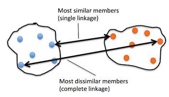

# Chapter 11
## This chapter will cover the following topics
* Finding centers of similarity using the popular k-means algorithms
* Using a bottom-up approach to build hierarchical cluster trees
* Identifying arbitrary shapes of objects using a density-based clustering approach

##### Grouping objects by similarity using k-means
* k-means algorithm
  - pro
    - computationally very efficient
    - easy to implement
    - identifying clusters of spherical shape
  - con
    - specify the number of clusters *k* a priority.
    - uses random seed that can result in bad clustering or slow convergence
    - one or more *k* can be empty
    - clusters do not overlap
  - inappropriate choice for *k* can result in poor clustering performance
  - category of prototype-based clustering
* prototype-based
  - each cluster is represented by a prototype
  - centroid (average) of similar points with continuous features
  - medoid (most representative or most frequently occurring point)
    - in the case of categorical features
* steps
  1. Randomly pick *k* centroids from the sample points as initial cluster centers
  2. Assign each sample to the nearest centroid &mu;(j), *j* &isin; {1,...,*k*}
  3. Move the centroids to the center of the samples that were assigned to it.
  4. Repeat steps 2 and 3 until the cluster assignment do not change or a user-defined tolerance or a maximum number of iterations is reached.

##### K-means++
* provides better results than K-means
* place initial centroids far away
* steps
  1. Initialize an empty set **M** to store the k centroids being selected
  2. Randomly choose the first centroid &mu;(j) from the input samples and assign it to **M**.
  3. For each sample **x**(i) that is not in **M**, find the minimum squared distance d(**x**(i), **M**)2 to any of the centroids in **M**.
  4. To randomly select the next centroid &mu;(p), use weighted probability distribution
  5. Repeat steps 2 and 3 until *k* centroids are chosen.
  6. Proceed with the classic k-means algorithm.

##### hard vs soft clustering
* hard clustering
  - each sample in a dataset is assigned to exactly one cluster
* soft clustering ( fuzzy clustering )
  - assign a sample to one or more clusters
  - popular approach fuzzy C-means (FCM) or soft k-means or fuzzy k-means
* FCM
  - similar to k-means
  - replace hard cluster assignment by probabilities for each point belonging to each cluster
  - steps
    1. Specify the number of k centroids and randomly assign the cluster memberships for each point.
    2. Compute the cluster centroids &mu;(j), *j* &isin; {1,...,k}
    3. Update the cluster memberships for each point
    4. Repeat steps 2 and 3 until the membership coefficients do not change or a user-defined tolerance or a maximum number of iterations is reach
  - more expensive but takes fewer iterations to get to convergence.
  - not in scikit but does produce similar results as k-means

##### elbow methods
* find the optimal number of clusters (k)
  - if k increases, distortion will decrease
    - samples will be closer to the centroids they are assigned to
* identify the value of *k* where the distortion begins to increase more rapidly
* if the elbow is @ 3 clusters and almost no change after that we know that we can just go with three clusters

##### silhouette plots
* evaluate the quality of a cluster
* measure of how tightly grouped the samples in the clusters are.
* steps
  1. Calculate the cluster cohesion *a*(i) as the average distance between a sample x(i) and all other points in the same cluster
  2. Calculate the cluster separation *b*(i) from the next closest cluster as the average distance between the sample x(i) and all samples in the nearest cluster
  3. Calculate the silhouette s(i) as the difference between cluster cohesion and separation divided by the greater of the two

##### hierarchical tree
* pro
  - used to plot dendrograms (visualizations of a binary hierarchical clustering)
  - don't need to specify the number of clusters close up
* agglomerative
  - opposite of divisive
  - each sample is made into a cluster
  - merge the closest pairs of clusters until only one cluster remains
* divisive
 - one cluster that encompasses all our samples
 - iteratively split the cluster into smaller clusters until each cluster only contains one sample
* single linkage
 - compute the distances between the most similar members for each pair of clusters
 - merge the most similar
* complete linkage
  - similar to single
  - compare dissimilar members to perform the merge

* agglomerative clustering
  - uses complete linkage approach
* steps
  1. compute the distance matrix of all samples
  2. Represent each data point as a singleton cluster
  3. Merge the two closest clusters based on the distance of the most dissimilar (distant) members
  4. Update the similarity matrix
  5. Repeat steps 2 to 4 until one single cluster remains

##### DBSCAN
* Density-based Spatial Clustering of Applications with Noise (DBSCAN)
* notion of density in DBSCAN is defined as the number of points within a specified radius &epsilon;
* a point is considered as core point if at least a specified number (MinPts) of neighboring points fall within the specified radius &epsilon;
* A border point is a point that has fewer neighbors than MinPts within &epsilon;, but lies within the &epsilon; radius of a core point.
* All other points that are neither core nor border points are considered as noise points
* steps
  1. form a separate cluster for each core point or a connected group of core points (core points are connected if they are no farther away from &epsilon;)
  2. Assign each border point to the cluster of its corresponding core point.
* unlike k-means and hierarchical clustering
  - DBSCAN doesn't assign points to each cluster
* removes noise points
* can detect other shapes besides spherical
  - book example showed the algorithm differentiating between two half moon shapes.

##### Summary
* learned techniques to find hidden structures or information in data
* k-means
  - clusters samples into spherical shapes based on a specified number of cluster centroids
* clustering is an unsupervised methods
  - look at useful intrinsic performance metrics
    - elbow method or silhouette analysis to quantify the quality of clustering
* hierarchical clustering
  - don't specify the number of clusters up front
  - results can be visualized in a dendrogram representation
* agglomerative clustering
  -
* DBSCAN
  - groups points based on local densities and is capable of handling outliers
  - identifying nonglobular shapes
