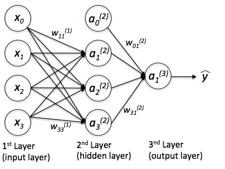
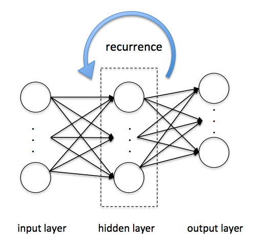

# Chapter 12
## This chapter will cover the following topics
* Getting a conceptual understanding of multi-layer neural networks
* Training neural networks for image classification
* Implementing the powerful backpropagation algorithm
* Debugging neural network implementations

##### Single-layer neural network recap
* Adaline
  - perform binary class-labels-classification
* gradient descent
  - optimization algorithm to learn the weight coefficients of the model.
* epoch
  - pass over the training set
  - updated the weight vector **_w_**

##### multi-layer neural network architecture
* aka multi-layer perceptron (MLP)
* 3 layers
  - input layer
  - hidden layer
    - fully connected to the input layer
  - output layer
    - fully connected to the hidden layer

* if a network has more than one hidden layer it is a deep artificial neural network
  - number of layers and units in a neural network as additional hyperparameters
  - error gradients become smaller when using backpropagation with more hidden networks

##### neural network via forward propagation
* forward propagation
  - used to calculate an MLP model
* MLP steps
  1. Starting t the input layer, we forward propagate the patterns of the training data through the network to generate an output
  2. Based on the network's output, we calculate the error that we want to minimize using a cost function that we will describe later.
  3. We backpropagate the error, find its derivative with respect to each weight in the network, and update the model.

##### Convolutional Neural networks
* build many layers of feature detectors to take the spatial arrangement of pixels in an input image into account
  - overlapping windows that are slid across the image

##### Recurrent Neural networks
* feedforward neural networks with feedback loops or backpropagation through time
  - the time variable that is within makes it harder to train.

##### Summary
* important concepts behind multi-layer artificial neural networks
* backpropagation algorithms
* looked into mini-batch learning and an adaptive learning rate to train neural networks more efficiently.
