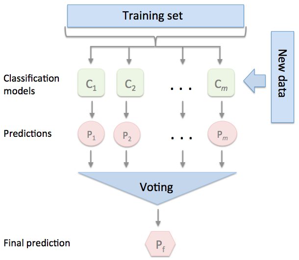

# Chapter 7
## This chapter will cover the following topics

* make predictions based on majority voting
* Reduce overfitting by drawing random combinations of training set with repetition
* Build powerful models from *weak learners* that learn from their mistakes

##### Ensembles
* combine different classifiers into meta-classifier that has a better generalization performance than alone
  - Example : collected predictions from 10 experts
    - ensemble will combine the 10 an make a better estimation overall
* majority voting principle
  - grab the class label that has been predicted by the majority of classifiers
    - received more than 50% of votes
  - binary class settings only
* plurality
  - majority voting but for multi-class settings
* with a training set
  - training m different classifiers (C1,...,Cm)
  - can use any number of algorithms
    - decision tree, SVM, logistic regression, etc

##### bagging
* also known as bootstrap aggregating
* best used with unpruned decision trees
* pro
  - improve the accuracy of unstable models
  - decrease degree of overfitting
* con
  - ineffective @ reducing model bias

##### Adaptive Boosting (AdaBoost)
* ensemble consists of simple base classifiers
  - aka weak learners
  - slightly better than random guessing
* let weak learners learn from misclassified training samples to improve performance of the ensemble
* main difference from bagging
  - boosting uses random subsets of training samples drawn from the training dataset without replacement
* boosting procedure
  1. Draw a random subset of training samples *d*1 without replacement from the training set *D* to train a weak learning C1
  2. Draw a second random training subset *d*2 without replacement from the training set and add 50% of the samples that were previously misclassified to train a weak learners *C*2
  3. Find the training samples d3 in the training set *D* on which *C*1 and *C*2 disagree to train a third weak learner *C*3
  4. Combine the weak learners *C*1, *C*2, and *C*3 via majority voting.
* boosting **can reduce bias and variance**
* AdaBoost may also create high variance
  - uses complete training set to train the weak learners where the training samples are reweighted in each iteration to build a strong classifiers that learns form the mistakes of the previous weak learners in the ensemble.

##### Summary
* techniques for ensemble learning
  - combines different classification models to cancel out their individual weakness
    - results in stable and well-performing models
* bagging
  - reduce the variance of a model by drawing random bootstrap samples from the training set and combining the individual trained classifiers via a majority vote
* AdaBoost
  - algorithm based on weak learners that subsequently learn from mistakes
